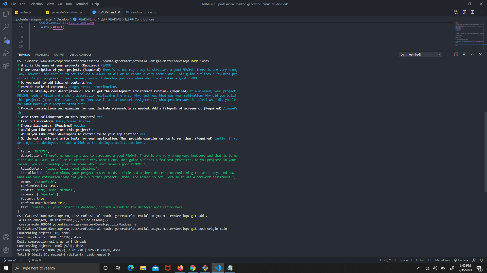

  # Professional README Generator

  

  ## Description
   To help users generate readme quickly and easily
    
  ## Table of Contents (Optional)
  If your README is very long, add a table of contents to make it easy for users to find what they need.
  * [Description](#description)
  * [Installation](#installation)
  * [Usage](#usage)
  * [Credits](#credits)
  * [License](#license)
  * [Features](#features)
  * [Contributions](#contributions)
  * [Tests](#tests)
  * [Questions](#questions)
 

   
    
  ## Installation
  * You have to clone the repository onto your local machine
    
  ## Usage
  
  Run node index.js in the terminal. if succesful, your terminal should look like this screenshot. 

  ## Credits
  

  This repository is licensed under [
  ## License
  Use this link if you need help choosing a license 
  [https://choosealicense.com/](https://choosealicense.com/)
  
  MIT
  ](https://opensource.org/licenses/MIT) license.
    
  ## Features
  Professional README Generator
    
  ## Contributions
  Feel free to refactor code
    
  ## Tests
  run node.js in terminal

  ## Questions
  If you have any questions or comment about this repository, you can reach me at [e.kankam95@hotmail.com](mailto: e.kankam95@hotmail.com).
  Feel free to view more of my work on GitHub at [kwabena95](https://github.com/kwabena95)
  